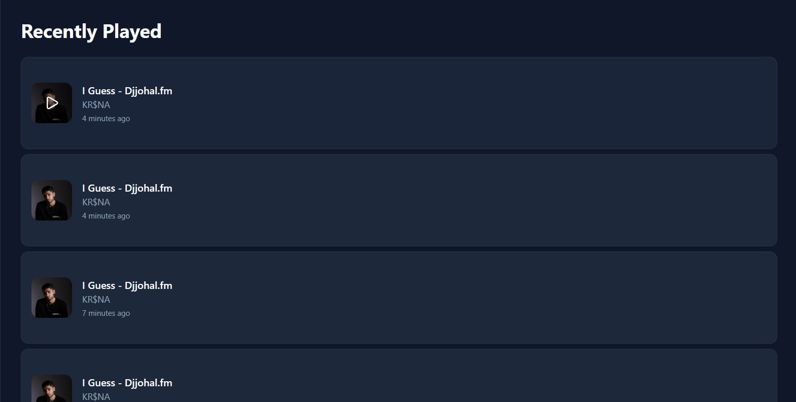

# Dhun 🎵

A modern, full-featured music and podcast streaming web application with light/dark theme support.


## ✨ Features

### 🎵 Core Features
- **Music Streaming** - Browse and stream music tracks with high-quality playback
- **Podcast Streaming** - Listen to podcast episodes
- **Audio Wave Visualization** - Real-time animated audio wave display with vertical/horizontal modes
- **Collapsible Audio Player** - Minimize player while music continues playing
- **Search** - Powerful search across all content
- **Playlists** - Create and manage custom playlists
- **Favorites** - Like and save your favorite tracks
- **Recently Played** - Track your listening history with resume functionality

### 🎨 User Experience
- **Light/Dark Theme** - Toggle between light and dark modes
- **Responsive Design** - Seamless experience on desktop and mobile
- **Modern UI** - Clean interface with smooth animations
- **Audio Controls** - Full playback controls with seek, volume, and mute
- **Collapsible Player** - Slide-down/slide-up animations for space-saving
- **Credits Page** - View developer information and technology stack

### 👨‍💼 Admin Features
- **Upload Tracks** - Upload music and podcast files
- **Manage Content** - Edit metadata and manage library
- **User Management** - Control user roles and permissions
- **Analytics Dashboard** - View content statistics

### 🚀 Deployment
- **GitHub Pages Ready** - Pre-configured for easy deployment
- **Automated CI/CD** - GitHub Actions workflow included
- **SPA Routing Support** - Client-side routing works on static hosting

## 🚀 Quick Start

### Prerequisites
- Node.js 18+ and npm/pnpm
- Supabase account (already configured)

### Installation

1. **Install Dependencies**
   ```bash
   npm install
   ```

2. **Start Development Server**
   ```bash
   npm run dev -- --host 127.0.0.1
   ```

3. **Open in Browser**
   ```
   http://localhost:5173
   ```

### First Time Setup

1. **Register Account**
   - Click "Sign up" on the login page
   - Enter a username and password
   - First user automatically becomes admin

2. **Explore Content**
   - Browse 6 sample music tracks
   - Listen to 4 sample podcast episodes
   - Create your first playlist

3. **Toggle Theme**
   - Click the theme button in the sidebar
   - Choose between light and dark modes

## 📖 Screenshots



## 🎨 Theme System

### Light Theme
- Clean white backgrounds
- Dark text for readability
- Purple accents (#8B5CF6)
- Subtle borders and shadows

### Dark Theme
- Dark navy backgrounds (#0F172A)
- Light text for contrast
- Purple accents (#8B5CF6)
- Elevated cards and components

### Features
- ⚡ Instant theme switching
- 💾 Persistent preference (localStorage)
- 🖥️ System preference detection
- ♿ WCAG AA compliant contrast

## 🛠️ Technology Stack

### Frontend
- **React 18.3** - UI framework
- **TypeScript 5.6** - Type safety
- **Vite** - Build tool
- **Tailwind CSS** - Styling
- **shadcn/ui** - Component library
- **Radix UI** - Accessible primitives

### Backend
- **Supabase** - Backend as a service
  - PostgreSQL database
  - Authentication
  - Storage
  - Row Level Security

### Audio
- **HTML5 Audio API** - Playback
- **Web Audio API** - Wave visualization

## 📁 Project Structure

```
src/
├── components/
│   ├── layouts/          # Layout components
│   │   └── MainLayout.tsx
│   ├── ui/               # shadcn/ui components
│   ├── common/           # Shared components
│   └── AudioPlayer.tsx   # Collapsible audio player
├── contexts/
│   ├── AuthContext.tsx   # Authentication
│   ├── AudioPlayerContext.tsx  # Audio state
│   └── ThemeContext.tsx  # Theme management
├── db/
│   ├── supabase.ts       # Supabase client
│   └── api.ts            # Database API
├── pages/                # Page components
│   ├── HomePage.tsx
│   ├── LoginPage.tsx
│   ├── MusicPage.tsx
│   ├── PodcastsPage.tsx
│   ├── SearchPage.tsx
│   ├── FavoritesPage.tsx
│   ├── PlaylistsPage.tsx
│   ├── AdminDashboardPage.tsx
│   └── CreditsPage.tsx   # Credits & about page
├── types/                # TypeScript types
├── hooks/                # Custom hooks
└── lib/                  # Utilities

.github/
└── workflows/
    └── deploy.yml        # GitHub Actions deployment

public/
├── .nojekyll            # GitHub Pages config
└── 404.html             # SPA routing handler
```

## 🗄️ Database Schema

### Tables
- **profiles** - User accounts and roles
- **tracks** - Music and podcast metadata
- **playlists** - User-created playlists
- **playlist_tracks** - Playlist-track relationships
- **favorites** - Liked tracks
- **recently_played** - Listening history

### Storage
- **audio-files** - Audio file storage bucket

## 🎯 Key Features Explained

### Audio Player
- Play/pause controls
- Seek bar with progress tracking
- Volume control with mute
- Like/favorite button
- Real-time wave visualization (40 animated bars)
- **Wave orientation toggle** - Switch between vertical and horizontal animations
- Resume playback from last position
- **Collapsible interface** - Minimize player with slide animations
- **Mini player mode** - Shows track info and play/pause when collapsed
- **Continuous playback** - Music never stops when toggling states

### Playlists
- Create unlimited playlists
- Add/remove tracks
- Reorder tracks (drag & drop ready)
- Share playlists (future feature)

### Search
- Search by title, artist, or podcast name
- Filter by content type (All, Music, Podcasts)
- Real-time results
- Debounced input for performance

### Admin Dashboard
- Upload audio files to Supabase Storage
- Add metadata (title, artist, category, cover image)
- View all tracks with management options
- Delete tracks
- Manage user roles
- View statistics (total tracks, users, playlists)

## 🔐 Authentication

### Username-Based Login
- No email required
- Username + password authentication
- Automatic admin role for first user
- Secure password hashing
- Session management via Supabase Auth

### Role-Based Access
- **User** - Browse, play, create playlists, like tracks
- **Admin** - All user features + content management + user management

## 📱 Responsive Design

### Desktop (1920x1080, 1366x768)
- Sidebar navigation
- Grid layouts (4-6 columns)
- Full audio player controls

### Mobile (375x667, 414x896)
- Hamburger menu
- Responsive grids (2 columns)
- Touch-optimized controls

## 🎨 Design System

### Colors
- **Primary**: Deep Purple (#8B5CF6)
- **Background**: White (light) / Dark Navy (dark)
- **Accent**: Purple variations
- **Charts**: Purple, Pink, Teal, Yellow

### Typography
- **Font**: System font stack
- **Sizes**: Responsive scale (text-sm to text-5xl)
- **Weights**: 400 (normal), 500 (medium), 600 (semibold), 700 (bold)

### Spacing
- **Base**: 4px (0.25rem)
- **Scale**: 0, 1, 2, 3, 4, 6, 8, 12, 16, 24, 32, 48, 64

## 🧪 Development

### Available Scripts

```bash
# Development server
npm run dev

# Type checking
npm run type-check

# Linting
npm run lint

# Build for production
npm run build

# Preview production build
npm run preview
```

### Code Quality
- ESLint for code linting
- TypeScript for type safety
- Prettier for code formatting (recommended)
- Git hooks for pre-commit checks (optional)

## 🚀 Deployment

### GitHub Pages (Recommended)

The application is pre-configured for GitHub Pages deployment with automated CI/CD.

**Quick Setup:**
1. Push code to GitHub repository
2. Go to **Settings** → **Pages** → Select **GitHub Actions** as source
3. Push to `main` branch triggers automatic deployment
4. Access at: `https://YOUR_USERNAME.github.io/YOUR_REPO_NAME/`

**Documentation:**
- See `GITHUB_PAGES_QUICK_SETUP.md` for 3-step setup guide
- See `GITHUB_PAGES_DEPLOYMENT.md` for comprehensive documentation

**Features:**
- ✅ Automated deployment via GitHub Actions
- ✅ Client-side routing support (BrowserRouter)
- ✅ Environment variables via GitHub Secrets
- ✅ Custom domain support
- ✅ Production-optimized builds

### Alternative Hosting (Vercel/Netlify)
1. Connect repository
2. Set build command: `npm run build`
3. Set output directory: `dist`
4. Add environment variables

### Environment Variables
```env
VITE_SUPABASE_URL=your_supabase_url
VITE_SUPABASE_ANON_KEY=your_supabase_anon_key
VITE_APP_ID=your_app_id
```

For GitHub Pages, add these as **Secrets** in repository settings.

## 🐛 Troubleshooting

### Audio Not Playing
- Check browser audio permissions
- Verify audio file URLs are accessible
- Try a different browser (Chrome recommended)

### Theme Not Persisting
- Check localStorage is enabled
- Clear browser cache
- Try incognito mode

### Upload Failing
- Ensure you're logged in as admin
- Check file size (keep under 10MB)
- Verify Supabase storage bucket exists

## 📝 License

Copyright © 2025 Dhun. All rights reserved.

## 🤝 Contributing

This is a demonstration project. For production use, consider:
- Adding comprehensive tests
- Implementing CI/CD pipeline
- Adding error tracking (Sentry)
- Performance monitoring
- SEO optimization
- PWA features

## 📞 Support

For issues or questions:
1. Check the documentation files
2. Review the troubleshooting section
3. Check browser console for errors

## 🎉 Acknowledgments

- **shadcn/ui** - Beautiful component library
- **Supabase** - Backend infrastructure
- **Radix UI** - Accessible primitives
- **Lucide** - Icon library
- **Tailwind CSS** - Utility-first CSS

---

**Built with ❤️ using React, TypeScript, and Supabase**

**Code by arxncodes</>**

**Enjoy streaming with Dhun! 🎵🎙️**
